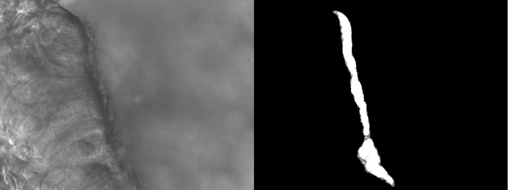
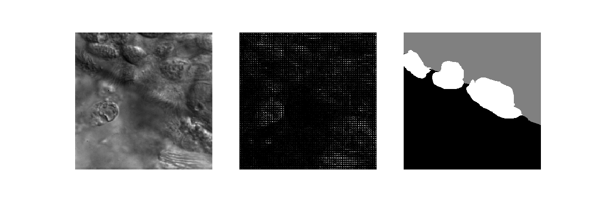

# Cilia Segmentation

This repository contains various algorithms implemented on cilia images segmentation which are completed on CSCI 8360, Data Science Practicum at the University of Georgia, Spring 2018.

This project uses the time series grayscale 8-bit images of cilia biopsies taken with DIC optics published in the study [Automated identification of abnormal respiratory ciliary motion in nasal biopsies](http://stm.sciencemag.org/content/7/299/299ra124). There are 325 videos, 211 (65%) for training set and 114 (35%) for testing set. For each video, they are formed by 100 successive frames and performed as a 0.5 seconds real-time video. 3-label masks come with the videos and the pixels of them are colored according to the corresponding videos as **2** for cilia, **1** for a cell, and **0** for the background. In this case, we are only interested in cilia segmentation, the misclassification of the cells and backgrounds are not considered here.

In this repository, we are offering three different methods as follows using different packages to locate the cilia and segment them out from the surrounding images.

1. Optical Flow using OpenCV
2. Convolutional Neural Network using Unet
3. Flatten images and Support Vector machine using OpenCV
4. Histogram of Gradient using scikit-image and Support Vector machine using OpenCV

Read more details about each algorithm and their applications in our [WIKI](https://github.com/dsp-uga/Flanagan/wiki) tab.


## Getting Started

These instructions will get you a copy of the project up and running on your local machine for development and testing purposes. See deployment for notes on how to deploy the project on a live system.

### Prerequisites

- [Python 3.6](https://www.python.org/downloads/release/python-360/)
- [Anaconda](https://www.anaconda.com/)

### Environment Setting

  1. **Clone this repository**
  ```
  $ git clone https://github.com/dsp-uga/Flanagan
  $ cd Flanagan
  ```

  2. **Create conda environment based on `environment.yml` offered in this repository**
  ```
  $ conda env create -f environments.yml -n cilia_env python=3.6
  $ source activate cilia_env
  ```

## Running the tests

```
python -m [algorithm] [args-for-the-algorithm]
```

##### Algorithms

  - `OpticalFlow`: Running Optical Flow
  - `CNN`: Running Convolutional Neural Network
  - `FM2SVM`: Running Support Vector Machine by flatten images
  - `HOG2SVM`: Running Support Vector Machine by HOG images

Each folders includes one module and you can run it through the command above. Each module provides their own arguments. Use `help()` to know more details when running the algorithms.


## Evaluation

The results count on the ratio of the values of intersection over union. Take the **intersection** as the area of overlap between the predicted region and the actual region, and the **union** as the area of the union of the predicted region and the actual region.

<p align = "center">

</p>

## Test Results


| Module    | arguments             | Mean IoU     |
|-----------|-----------------------|--------------|
|OpticalFlow|                       | 19.6772      |
|CNN        |N/A                      N/A
|FM2SVM     |                       | -            |
|HOG2SVM    |N=30                   | 9.01251      |
|HOG2SVM    |N=20                   | 7.93707      |


## Discussion

  1. **Optical Flow**

      - Calculates two-frame motion estimation and computes a degree of flow for each pixel. Ends up with `N-1` degree matrices for a video of `N` frames
      - A sum of these degree matrices is found and scaled down to `{0,1,2}` by observing the pixles in motion
      - Difficult to scale the videos where even the cell has a motion. Results in larger areas of motion. This effected on overall mean IoU
      - Visualisation of one frame of the video and the predicted mask:

      <p align = "center">
      
      </p>

  2. **Convolutional Neural Network**

      - Used the UNET architecture to try to segment pixels into binary classification: cilia or not a cilia. 
      - First had to "chunk" up the test files so that they would all be a consistent size for input into the CNN.
      - 5000 training epochs were run on each training dataset: one picture from the video chosen at random and cropped at random to fit the size requirements, fed through the machine and the weights corrected with back prop.
      - Predictions were then made individually for each image of a video for each testing chunk, the predictions averaged out, and the predictions stitched back together again.
      - Results were not promising. 

  3. **Support Vector Machine with Flatten Images**

      - Flattening `N` images, each of dimension `(X, Y)` results in a matrix of dimension `(X*Y, N)`
      - Each row of matrix is labelled with respective pixel in the mask
      - Takes a huge amount of time to perform SVM. Tried on small data with 10 train samples and 2 test samples, which took about 5 hours to train SVM and 40 minutes to predict. Ended up with no desired output
      - Pixelwise segmentations are not suitable to use Support Vector Machine

  4. **Support Vector Machine with Histogram of Gradient**

      - HOG works well in detecting the shape of cells but not cilia (Cilia are too thin and small to detect)
      - Instead of inputting HOG feature descriptors in SVM, we used HOG images since the labels are assigned to each pixel but not each image. That is to say, stacking all pixels of 211 training videos, there will be 4 million instances in SVM.
      - Since we have small patches setting in HOG, it took 24 hours to run all HOG descriptors (Both training and testing set)
      - It takes forever to run the model because of the great amount of instances
      - Visualization of one frame of the video, one hog frame of the video, and the mask:

      <p align = "center">
      
      </p>

      - Pixelwise segmentations are not suitable to use Support Vector Machine

## Authors
(Ordered alphabetically)

- **I-Huei Ho** - [melanieihuei](https://github.com/melanieihuei)
- **Nicholas Klepp** - [NBKlepp](https://github.com/NBKlepp)
- **Vinay Kumar** - [vinayawsm](https://github.com/vinayawsm)

See the [CONTRIBUTORS](CONTRIBUTORS.md) file for details.

## License

This project is licensed under the MIT License - see the [LICENSE.md](LICENSE.md) file for details
